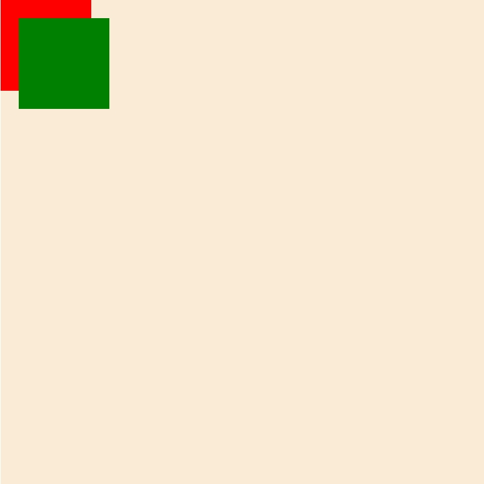
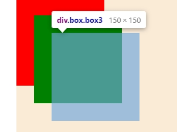

# 작성 날짜: 2021.08.15-3
# 오늘의 목표
HTML / CSS 복습하자!
# 공부 내용
## 1. Position
## 2.  Background-image
## 3. vh-vw


# Position
	static : (기본값) 위치를 지정하지 않을때
	relative: 부모요소가 된다
	absolute: 부모를 기준으로 뜨는 자식요소
	fixed : 화면에서 고정시킨다.
	z-index: 층을 정해준다. (position 적용시 0층)
+ 자주쓰는 position의 내용이다.

```html
<div class="wrapper ">가나다라
  <div class="box box1"></div>
  <div class="box box2"></div>
  <div class="box box3"></div>
</div>
```
```css
.wrapper {max-width: 800px; height: 800px; margin: auto; background-color: antiquewhite; position: relative;}
.box {width: 150px; height: 150px;}
.box1 {z-index: 4; background-color: red; position: absolute; top: 0; left: 0; }
.box2 {z-index: 5; background-color: green; position: absolute; top: 30px; left: 30px;}
.box3 { z-index: -1;background-color: blue; position: absolute; left: 60px; top: 60px;}
```
+ 이렇게 적용 해보았다. 결과는

+ box3은 어딜갔을까!?
  
+  z-index가 음수로 가니 뒤로 숨는다.


# 2. background-image
	background-color 는 바탕색이다. 그럼 image는?
	말그대로 바탕에 이미지를 넣어준다
```css
background-image: url(이미지의 주소)
background-repeat: repeat|repeat-x,y|no-repeat
background-position: 배경 위치지정
background-size:배경 크기지정 cover: 꽉참
background-attachment:scroll|fixed|local
```
[background-image해보기](https://binibin-pr.web.app/html/index.html)

# 3.vw-vh
```css
{width:100px} --> 1vw:10px
{height:950px} --> 1vh: 9.5px
```
+ 요소의 넓이의 1/100이라고 생가하면 쉬움.
+ 100vh,vw를 사용하면 화면에 꽉찬다.
# Review
이떄 vw,vh라는게 되게어려웠는데 지금은 이해 잘되고 <br>
position은 언제나 어렵고 새로운거같다..<br> 하지만 원리는 이해한다!. 


