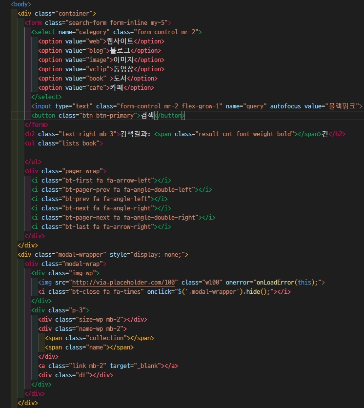

# 작성 날짜: 2021-08-17
# 오늘의 목표
1. AXIOS통신을 이용한 데이터 전송(Post man)
2. pager 만들기
3. 나머지 추가 내용
# 공부 내용
# 1. AXIOS
## HTML 내용

## 전역변수 선언
```js
/***** global init *****/
var auth = '내 카카오';
var kakaoURL = 'https://dapi.kakao.com/'
var cate, query, page = 1;
var size = { web: 10, blog: 10, book: 10, cafe: 10, vclip: 15, image:80 }
```
## 서버 연결
```js
// axios를 통해 ( GET방식 )서버에 연결 onSubmit
axios.get(getPath(cate), getParams(query)).then(onSuccess).catch(onError);
//Path와 Params를 얻고 성공하면 onSuccess실행 에러가 있으면 onError실행
```
## User Function
```js
function getPath(cate) {	//cate는 web, book, image, vedio, cafe, blog
    return kakaoURL + (cate === 'book' ? 'v3': 'v2')+/search/+ cate;
}
function getParams(query) {
  return{	//size, page는 pager를 위해 / 객체를 배열로 받을 수 있음
      params: { query: query, size: size[cate], page: page },
      headers: { Authorization: auth }
  }
} 
```
## Event Callback
```js
// setTotalCnt
function setTotalCnt(cnt) {
    $('.result-cnt').html(numberFormat(cnt));
}
//onSuccess
function onSuccess(res) {
    var cateStr = res.config.url.split('/').pop();	//cate와 같지만 충돌 방지.
    var v = res.data;	// axios에서 전달받은 값의 data
    setTotalCnt(v.meta.pageable_count); // 구현 가능한 페이지의 수
    setPager(v.meta.is_end, v.meta.pageable_count);	
		//is_end 마지막페이지? return true | false
    switch(cateStr){
        case 'web':
            setWebLists(v.documents);
            break;
        case 'image':
            setImageLists(v.documents);
            break;
        case 'vclip':
            setClipLists(v.documents);
            break;
        case 'blog':
            setBlogLists(v.documents);
            break;
        case 'book':
            setBookLists(v.documents);
            break;
        case 'cafe':
            setCafeLists(v.documents);
            break;
    }
}
//onError
function onError(err) {
    console.log(err);	//console창에 에러내용을 알려줌.
}
//onSubmit 
function onSubmit(e) {
	e.preventDefault();	//evnet 고유의 동작을 멈추게함.
	cate = $(this).find('select[name="category"]').val().trim();
	query = $(this).find('input[name="query"]').val().trim();
	if(cate && cate !== '' && query && query !== '')
		axios.get(getPath(cate), getParams(query)).then(onSuccess).catch(onError);
	else
		$(this).find('input[name="query"]').focus();
        //alert('검색조건이 충분하지 않습니다. 다시 시도해 주세요.')
}
```
## Event init
```js
$('.search-form').submit(onSubmit);	// 전송 이벤트
// pager 이벤트 pager 부분에서 다룰 예정.
$('.pager-wrap .bt-first').click(onPagerClick);
$('.pager-wrap .bt-pager-prev').click(onPagerClick);
$('.pager-wrap .bt-prev').click(onPagerClick);
$('.pager-wrap .bt-next').click(onPagerClick);
$('.pager-wrap .bt-pager-next').click(onPagerClick);
$('.pager-wrap .bt-last').click(onPagerClick);
```
## web 데이터 불러오기
```js
function setWebLists(r) { //.list를 비워놓고 class 추가!
    $('.lists').empty().attr({'class': 'lists web', 'style': '' });
    r.forEach(function(v, i) {	//onSuccess에서 받은 인자
        var html = '<li class="list">';
        html += '<a class="title" href="'+v.url+'" target="_blank">'+v.title+'</a>';
        html += '<p class="content">'+v.contents+'</p>';
        html += '<a href="'+v.url+'" class="link" target="_blank">'+v.url+'</a>';
        html += '<div class="dt">'+moment(v.datetime).format('YYYY-MM-DD HH:mm:ss')+'</div>';
        html += '</li>';
        $('.lists').append(html);
    });
}
```
## image 데이터 불러오기
```js
function setImageLists(r) {
	$('.lists').empty().attr({'class' : 'lists image grid-wrap', 'style': ''});
	$('.lists').append('<li class="list grid-sizer"></li>');
	r.forEach(function(v, i) {
        var info = JSON.stringify({	// 문자열로 바꾸어줌.
            collection: v.collection,
            width: v.width,
            height: v.height,
            src: v.image_url,
            thumb: v.thumbnail_url,
            name: v.display_sitename,
            url: v.doc_url,
            dt: v.datetime
        });
		var html = '<li class="list grid-item" data-info=\''+info+'\'>';
		html += '';
        html += '<div class="info"></div>'
		html += '</li>';
		$(html).appendTo('.lists').click(onModalShow);
	});
	var $grid = $('.grid-wrap').masonry({
		itemSelector: '.grid-item',
		columnWidth: '.grid-sizer',
		percentPosition: true
	});
	$grid.imagesLoaded().progress(function() {
		$grid.masonry('layout');
		$grid.masonry('reloadItems');
	});

}
```
## book 데이터 불러오기
```js
function setBookLists(r) {
    $('.lists').empty().attr({'class': 'lists book', 'style': '' });
    var html = '';
    r.forEach(function(v, i) {
        var author = v.authors.join(', ');
        var thumbnail = v.thumbnail !== '' ? v.thumbnail : 'http://via.placeholder.com/120x174/eee?text=No+image';	//임시 이미지 생성
        var translator = v.translators.join(', ');
        var salePrice = (v.sale_price > -1 ? numberFormat(v.sale_price) + '원' : '판매중지');	//가격이 -1라면 '판매 중지'
        var isbn = v.isbn.replace(' ', ' / ');
        var dt = moment(v.datetime).format('YYYY-MM-DD');
        html ='<li class="list">';
        html +='<a class="title" href="'+v.url+'" target="_blank">'+v.title+'</a>';
        html +='<div class="info-wrap">';
        html +='<a class="thumb-wp" href="'+v.url+'" target="_blank">';
        html +='';
        html +='</a>';
        html +='<div class="info-wp" target="_blank">';
        html +='<div class="authors">';
        html +='<span class="author">'+author+'</span>';
        if(v.translators.lenght) html +='<span class="translator"> (역: '+translator+')</span>';	//2명의 번역자가 있을 수도 있음
        html +='</div>';
        html +='<div class="prices">';
        html +='<span class="price">'+numberFormat(v.price)+'</span> | ';
        html +='<span class="sale-price">'+salePrice+'</span>';
        if(v.status) html +='<span class="status">['+v.status+']</span>';
        html +='</div>';
        html +='<div class="publisher">'+v.publisher+'</div>';
        html +='<div class="isbn">'+isbn+'</div>';
        html +='<div class="dt">'+dt+'</div>';
        html +='</div>';
        html +='</div>';
        html +='<a class="content" href="'+v.url+'" target="_blank">'+v.contents+'</a>';
        html +='</li>';
        $('.lists').append(html);
    });
}
```
## vclip 데이터 불러오기
```js
function setClipLists(r) {
    $('.lists').empty().attr({'class': 'lists clip', 'style': '' });
    var html = '';
    r.forEach(function(v, i){
        html ='<li class="list">';
        html +='<a href="'+v.url+'" class="thumbs" target="_blank">';
        html +='';
        html +='</a>';
        html +='<div class="contents">';
        html +='<a class="title" href="'+v.url+'" target="_blank">'+v.title+'</a>';
        html += '<div>';
        html +='<a class="author" href="'+v.url+'" target="_blank">'+v.author+'</a> | ';
        html +='<span class="play-time">'+getPlayTime(v.play_time)+'</span>';   //util.js 추가내용에 서술
        html +='</div>';
        html +='<a href="'+v.url+'" class="link" target="_blank">'+v.url+'</a>';
        html +='<div class="dt">'+moment(v.datatime).format('YYYY-MM-DD HH:mm:ss')+'</div>';
        html +='</div>';
        html +='</li>';
        $('.lists').append(html);
    });
}
```
## cafe 데이터 불러오기
```js
function setCafeLists(r) {
    $('.lists').empty().attr({'class': 'lists cafe', 'style': '' });
    var html = '';
    r.forEach(function(v, i) {
        html ='<li class="list">'
        html +='<a href="'+v.url+'" class="thumbs" target="_blank">'
        html +=''
        html +='</a>'
        html +='<div class="contents">'
        html +='<a class="title" href="'+v.url+'" target="_blank">'+v.title+'</a>'
        html +='<p class="content">'+v.contents+'</p>'
        html +='<a class="name" href="'+v.url+'" target="_blank">'+v.cafename+'</a> | <a href="" class="link">'+v.url+'</a>'
        html +='<div class="dt">'+moment(v.datatime).format('YYYY-MM-DD HH:mm:ss')+'</div>'
        html +='</div>'
        html +='</li>'
        $('.lists').append(html);
    });;
}
```
## blog 데이터 불러오기
```js
function setBlogLists(r) {
    $('.lists').empty().attr({'class': 'lists blog', 'style': '' });
    var html = '';
    r.forEach(function(v, i) {
        html ='<li class="list">'
        html +='<a href="'+v.url+'" class="thumbs" target="_blank">'
        html +=''
        html +='</a>'
        html +='<div class="contents">'
        html +='<a class="title" href="'+v.url+'" target="_blank">'+v.title+'</a>'
        html +='<p class="content">'+v.contents+'</p>'
        html +='<a class="name" href="'+v.url+'" target="_blank">'+v.blogname+'</a> | <a href="" class="link">'+v.url+'</a>'
        html +='<div class="dt">'+moment(v.datatime).format('YYYY-MM-DD HH:mm:ss')+'</div>'
        html +='</div>'
        html +='</li>'
        $('.lists').append(html);
    });
}
```
# 2. Pager
## setPager
+	미완성 pager 오류 (08.17)
```js
// 젤 끝 pager로 가는 버튼을 누루면 pager가 사라짐. 수정예정
function setPager(isEnd, totalRecord) {
    page = Number(page);
	var totalPage = Math.ceil(totalRecord/size[cate]); // 총 페이지수
	if(totalPage > 50) totalPage = 50;
	if(cate === 'vclip' && totalPage > 15) totalPage = 15;
	var pagerCnt = 5;			// pager에 보여질 페이지 수
	var startPage;				// pager의 시작 번호
	var endPage;					// pager의 마지막 번호
	startPage = Math.floor((page - 1) / pagerCnt) * pagerCnt + 1;
	endPage = startPage + pagerCnt - 1;
	if(endPage > totalPage) endPage = totalPage;
	$('.pager-wrap .bt-page').remove(); // el가 삭제되면 이벤트도 삭제된다.
	for(var i=startPage; i<=endPage; i++) {
		// $('.pager-wrap .bt-next').before('<a href="#" class="bt-page">'+i+'</a>');
		if(i === page) 
			$('<i class="bt-page active" data-page="'+i+'">'+i+'</i>').insertBefore('.pager-wrap .bt-next').click(onPagerClick);
		else
			$('<i class="bt-page" data-page="'+i+'">'+i+'</i>').insertBefore('.pager-wrap .bt-next').click(onPagerClick);
	}	//js를 통해 dataset에 접근.
	$('.pager-wrap .bt-first')[0].dataset['page'] = 1;
	$('.pager-wrap .bt-pager-prev')[0].dataset['page'] = startPage === 1 ? 1 : startPage - 1;
	$('.pager-wrap .bt-prev')[0].dataset['page'] = page === 1 ? 1 : page - 1;
	$('.pager-wrap .bt-next')[0].dataset['page'] = page === totalPage ? totalPage : page + 1;
	$('.pager-wrap .bt-pager-next')[0].dataset['page'] = endPage === totalPage ? endPage : endPage + 1;
	$('.pager-wrap .bt-last')[0].dataset['page'] = totalPage;
}
```
# 3. 나머지 추가내용
## 1. switch문
## 2. util.js 추가내용
+ setClipList의 getPlayTime()
```js
// vclip을 불러왔을때 영상의 길이를 나타내고 싶었다.
function getPlayTime(s) {	// 's(초)'를 받았다. 
// 첫번째.
zp(s/60) +':'+ zp(s%60);	// result: 03.8:48  나눈뒤 소숫점 자리를 버려야겠다.

// 두번째
 zp( Math.floor(s/60) ) +':'+ zp(s%60); // 분 : 초 잘나온다.

 
// 세번째. 영상의 길이가 1시간이 넘어갈 경우
 if(Math.floor(s/60) >= 60) 
	 return Math.floor(s/3600) + ':' + Math.floor(s/60%60) + ':' + + zp(s%60);
 else 
 	zp( Math.floor(s/60) ) +':'+ zp(s%60);
}
```
+ zp()
```js
// zp의 역할. 10이하의 숫자 앞에 0 을 붙여줌
function zp(n){
	return (n > 10) ? '0'+n : n;
	// n이 10보다 작으면 '0'n,	n = 9 -> 09
}
```
## 3. join, replace
```js
//join	배열
var arr = ['손흥민','박지성','김연경']
arr.join('&');	
['손흥민'&'박지성'&'김연경' ] // join( 이 안의 내용이 추가됨 )

//replace 치환 문자열
'0000 0000'.replace(' ',' / ')	// 빈 칸을 '/' 로 치환
"0000 / 0000"
```
## 4. insertAfter() - jQuery.Method
| 메서드 | 내용|
|:---:|:----:|
|`after()`|A.after(B) - A뒤에 B를 추가| 
|`insertAfter()`|A.insertAfter(B) - B뒤에 A를 추가
|`before()`|A.before(B) - A앞에 B를 추가
|`insertBefore()`|A.insertBefore(B) - B앞에 A를 추가


# Review
데이터를 불러와서 넣는방법은 몇번 해보니 감이온다. <br>pager는 백엔드 들어가서 더 자세히 배운다고 하니 어떤 원리인지 이해를 하는데 중점을 두었다. <br>
jQuery 와 Java Script가 섞여서 만들면 힘들지만 어느정도 이해는 간다..<br>
 


