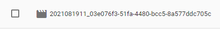

# 작성 날짜: 2021-08-19
# 오늘의 목표
+ ### Firebase의 storage에 데이터 넣기
# 공부 내용
1. storage에 사진 넣기 (파일명)
2. video 넣기
3. 화면에 이미지,동영상 띄우기
4. 넣은 내용 리스트 만들기

## HTML
```html
<script src="/__/firebase/8.8.1/firebase-app.js"></script>
    <script src="/__/firebase/8.8.1/firebase-auth.js"></script>
    <script src="/__/firebase/8.8.1/firebase-database.js"></script>
    <script src="/__/firebase/8.8.1/firebase-storage.js"></script>
    <script src="/__/firebase/8.8.1/firebase-analytics.js"></script>
    <script  src="/__/firebase/init.js?useEmulator=true"></script>
    <script src="../js/jquery.min.js"></script>
    <script src="../js/moment.min.js"></script>
    <script src="../js/lodash.min.js"></script>
    <script src="../js/uuidv4.min.js"></script>
    <script src="../js/promise.polyfill.min.js"></script>
    <script src="../js/util.js"></script>
<!-- body -->
 <header class="header-wrapper">
        <h1 class="logo-wrap">
            <div class="photo-logo"></div>
            <i class="icon-logo fa fa-user-circle"></i>
            <span class="name">Binibin-Score</span>
        </h1>
        <ul class="navi-wrap">
            <li class="navi bt-login">
                <i class="fab fa-google"></i>
                <span class="name">Login</span>
            </li>
            <li class="navi bt-logout">
                <i class="fa fa-sign-out-alt"></i> 
                <span class="name">Logout</span>
            </li>
        </ul>
    </header>
    <div class="container my-5 p-4 border">
        <form name="uploadForm">
            <div class="d-flex">
                <input type="file" name="upfile" class="form-control-flie flex-grow-1">
                <button class="btn btn-primary flex-shrink-0">업로드</button>
            </div>
        </form>
        <div class="text-center p-5">
            
        </div>
    </div>
```
## JS
<hr>

## 전역변수
```js	
var auth = firebase.auth();
var database = firebase.database();
var storage = firebase.storage();
var googleAuth = new firebase.auth.GoogleAuthProvider();
var dbRoot = database.ref('root/uploads');  
var stRoot = storage.ref().child('imgs'); //storage의 ref의 자식들 중에 'imgs'
var user = null;
var allowExt = ['jpg', 'jpeg', 'png', 'gif', 'mp4'];
```
<hr>

## Event init
```js
auth.onAuthStateChanged(onAuthChanged);
$('.bt-login').click(onLogin);
$('.bt-logout').click(onLogout);
$('form[name="uploadForm"]').submit(onSubmit);
```
<hr>

## Call back
```js
function onAuthChanged(r) {
    if(r) {
        $('.bt-login').hide();
        $('.bt-logout').show();
    }
    else {
        $('.bt-login').show();
        $('.bt-logout').hide();
    }
}
function onLogin() {
    auth.signInWithPopup(googleAuth);		// google 로그인창(팝업)
}

function onLogout() {  
    auth.signOut();
}

function onSubmit(e) {
    e.preventDefault();	// submit 막음
    var el = document.querySelector('input[name="upfile"]');
    if(el.files.length) {
        var file = document.querySelector('input[name="upfile"]').files[0];	// input type="file"만 가능
        var savename = genFile();
        var uploader = stRoot.child(savename).put(file);
        uploader.on('state_changed', onUploading, onUploadError, onUploaded)
    }
}
```
## 로그인 하면 저장된 데이터가 노출
```js
function onAuthChanged(r) {
    // console.log(r);
    user = r;
    if(user) {
        $('.bt-login').hide();
        $('.bt-logout').show();
        dbRoot.on('child_added', onAdded);
    }
    else {
        $('.bt-login').show();
        $('.bt-logout').hide();
        $('.list-wrap').empty();
        $('.main-img').attr('src', '').hide();
        $('.main-video').attr('src', '').hide();
    }
}
```
```js
function onAdded(r) {
    '// console.log(r, r.key, r.val());'
    html = '<li class="list">'
    if(r.val().type.indexOf('image') > -1 ) {
        html += '<a href="'+r.val().path+'" target="_blank"></a>';
    }
    else{
        html += '<a href="'+r.val().path+'" target="_blank"><video src="'+r.val().path+'"></a>';
    }
    html += '</li>'
    $(html).prependTo('.list-wrap')
}
```
<hr>

## User function
```js
function genFile() {
    return new Date().getTime() + '_' + random(100, 1000);
    
}	'// 파일명 에 시간과 난수를 부여함'
```
+ 서버상에 같은 파일 이름으로 올라올 수 있어서 서버상의 이름을 부여함.
+ 다운받을땐 원래의 이름으로 다운로드 가능

## uuid 사용하기(범용 고유 식별자)
    절대 겹칠 수 없는 값
+ 기존 `genFile()`에서 `return`값을 변수 folder에 담고
+ `uuidv4()`실행
```js
function genFile() {
    var folder = moment().format('YYYYMMDDHH');
    return {
        folder: folder,
        file: folder + '_' + uuidv4()
    }
}
```
+ 이렇게 추가된다 <br>


## onSubmit 추가 내용
```js
    e.preventDefault();
    var el = document.querySelector('input[name="upfile"]');
    if(el.files.length && user) {
        var file = document.querySelector('input[name="upfile"]').files[0];  
        if(allowExt.indexOf( file.name.split('.').pop().toLowerCase() ) > -1){
            var savename = genFile();
            var uploader = stRoot.child(savename.folder).child(savename.file).put(file);
            uploader.on('state_changed', onUploading, onUploadError, onUploaded)
        }
        else alert('업로드 가능한 파일은 이미지 또는 mp4영상 입니다.')
    }
    else if(user === null){
        alert('로그인 후 시도해 주세요.');
    }
    else {
        $('input[name="upfile"]').focus();
    }
```
## `state_changed` callback
```js
function onUploading(snapshot) { '// snapshot: 주로 현재 상태를 뜻하는 인자로 씀.'
    console.log('uploading', snapshot.bytesTransferred); '// 파일의 업로드 되는 과정을 보여줌'
    console.log('uploading', snapshot.totalBytes);  '// 파일 크기'
    upfile = snapshot;
    }
```
```js
function onUploadError(err) {
        console.log('error', err);
        if(err.code === 'storage/unauthorized') location.href = '../403.html'
        else console.log('error',err);
        '//location.href = '../403.html'-> 서버에 한번 더 요청 403으로 넘어감'
    }
```
+ 로그인을 하지 않은 상태에서 파일을 업로드 하려할때 403에러를 보여준다.
```js
function onUploaded() {
        upfile.ref.getDownloadURL().then(onSuccess).catch(onError); '//getDownloadURL 다운로드 주소를 받음'
    }
```
## onSuccess 
```js
    function onSuccess(r) {
        $('.mainp-wrap').addClass('py-5');
        if(file.type.split('/')[0] === 'image'){    
            $('.main-img').attr('src', r).show();
            $('.main-video').hide();
        } 
        else if(file.type.split('/')[0] === 'video'){
            $('.main-video').attr('src', r).show();
            $('.main-img').hide();
        }
        var saveData = {    '// realtime database에 파일을 올리면서 보내줄 내용'
            oriname: file.name,
            savename: savename.file,
            path: r,
            type: file.type,
            size: file.size,
        }
        console.log(file);
        dbRoot.push(saveData);
    }
    function onError(err) {
        console.log(err)
    }
}
```
## onAdded
```js
function onAdded(r) {
    // console.log(r, r.key, r.val());
    html = '<li class="list">'
    if(r.val().type.indexOf('image') > -1 ) {
        html += '<a href="'+r.val().path+'" target="_blank"></a>';
    }
    else{
        html += '<a href="'+r.val().path+'" target="_blank"><video src="'+r.val().path+'"></a>';
    }
    html += '</li>'
    $(html).prependTo('.list-wrap')
}
```
# Review
firebase는 백엔드 영역이 만들어져있어서 되게 제한되는것도 많다.
ES5 /ES6 차이도 점점 알아가고있다. 모든걸 이해하기보다 원리를 이해하자.!


